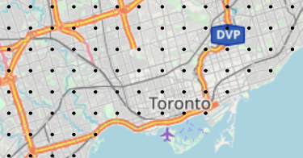
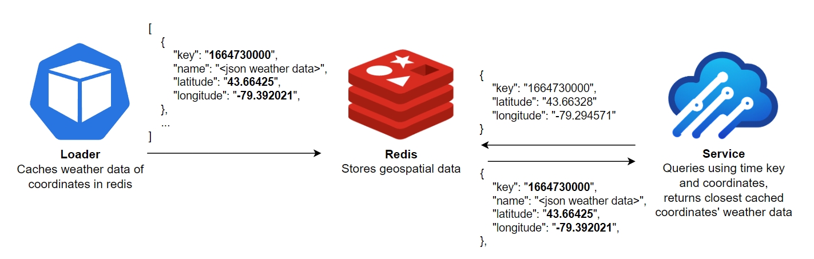

<h1 align="center">
  <br>
  
  <br>
  WiperCheck
  <br>
</h1>
<h4 align="center">An API that analyzes your road trip and returns weather conditions along your journey.</h4>
<br/>

This repo is for the loader component of WiperCheck. For the WiperCheck service see [here](https://github.com/evanhutnik/wipercheck-service).

## Loader

The loader is an optional component for caching forecasted weather data to improve performance. It scans over a configured coordinate grid, retrieving and caching hourly weather data for the following 48 hours.



### Built With
* [![Go][go-shield]][go-url]
* [![Redis][redis-shield]][redis-url]
* [![AWS][aws-shield]][aws-url]

## How It Works
The loader runs as a continuous job, populating over the specified area in a loop. Once retrieved from OpenWeather, the forecasted weather data is cached using redis' geospacial functionality. This feature allows a user to pass in a coordinate, to which redis will return the coordinates in the database closest to it. By setting the `key` value of the weather data saved in redis to the unix time of the weather information and the `name` to the weather data, the service can find the closest cached weather data to a given coordinate at a given time in a simple query.



## Getting Started
For deploying to AWS, see [wipercheck-infra](https://github.com/evanhutnik/wipercheck-infra). The below steps are for local development.

### Prerequisites
* Go 1.17 or later
* A redis cluster for caching the forecasted weather data

### Installation

1. Clone the repo
   ```sh
   git clone https://github.com/evanhutnik/wipercheck-loader.git
   ```
   
2. Get an API key for [OpenWeather](https://home.openweathermap.org/users/sign_up)

3. Add file named `.env` to root of project with the following fields:
   ```sh
   loader_start_lat=47.875
   loader_start_lon=83.923
   loader_stepdistance=10
   loader_duration=60
   openweather_apikey={api key}
   openweather_baseurl=https://api.openweathermap.org/data/2.5/onecall
   redis_address={redis url}
   ```

   `loader_start_lat`: The latitude of the cache start point.

   `loader_start_lon`: The longitude of the cache start point.

   `loader_stepdistance`: The distance, in kilometres, between each cached location. The points are cached in a grid shape, 	so a value of 10 would result in locations being cached every 10km east-west as well as north-south.
   
    `loader_duration`: The amount of time, in seconds, it will take to complete an entire cache cycle. Ex. a value of 3600 seconds would result in a 60x60 grid east/south of the starting point.
   <br/><br/>
4. Build the loader
   ```sh
   go build -o ./bin/wipercheck-loader ./cmd/loader/main.go
   ```
   
5. Run the executable
   ```sh
   ./bin/wipercheck-loader
   ```

[go-shield]: https://img.shields.io/badge/Go-00ADD8?style=for-the-badge&logo=go&logoColor=white
[go-url]: https://go.dev/
[redis-shield]: https://img.shields.io/badge/redis-%23DD0031.svg?&style=for-the-badge&logo=redis&logoColor=white
[redis-url]: https://redis.io/
[aws-shield]: https://img.shields.io/badge/Amazon_AWS-232F3E?style=for-the-badge&logo=amazon-aws&logoColor=white
[aws-url]: https://aws.amazon.com/

## Acknowledgments
* [DALL-E](https://openai.com/blog/dall-e/) for generating the WiperCheck logo
* [Will](https://github.com/whutchinson98) for helping with the CDK code